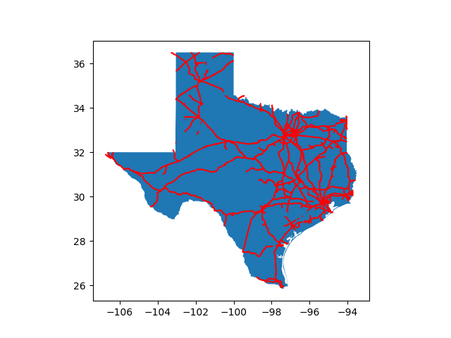
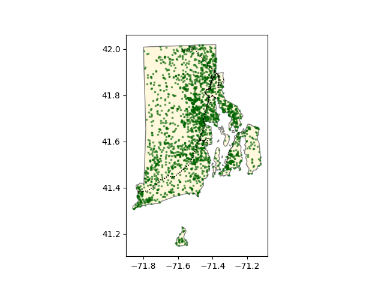
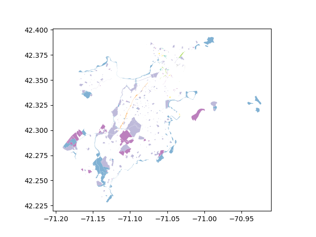
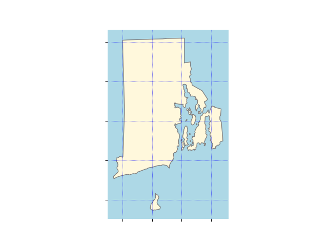
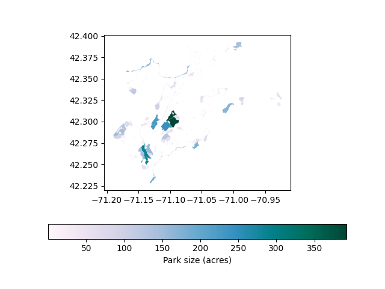
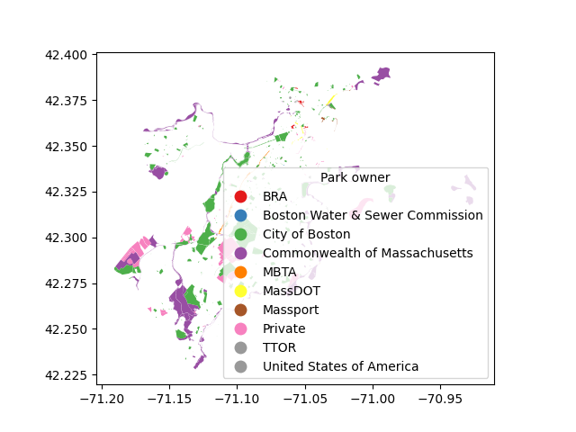
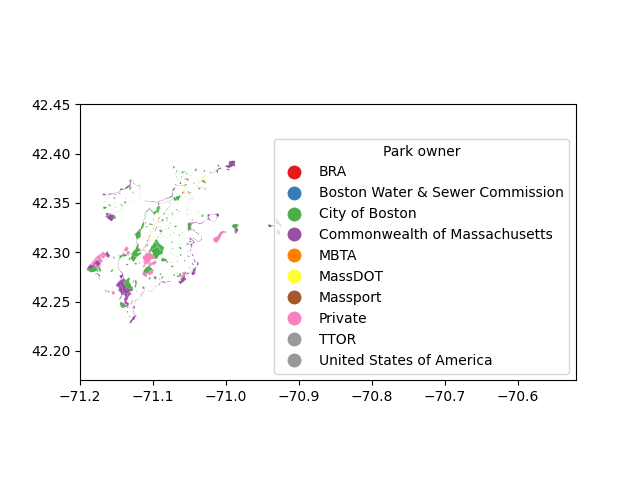

```{r setup, include=FALSE}
knitr::opts_chunk$set(echo = TRUE)
#knitr::knit_engines$set(python = reticulate::eng_python) 
```

This page introduces useful skills for displaying
geospatial data on a map using R, Python, QGIS, or ARcGIS.

The R skills on this page use the following R packages:

```{r, message=FALSE}
library(tigris)
library(rnaturalearth)
library(sf)
library(here)
library(tidyverse)
library(leaflet)
library(ggspatial)
library(ggthemes)
library(htmlwidgets)
library(here)
library(RColorBrewer)
```

In order to run Python code from RStudio, I'm using the `reticulate`
package and setting up my RStudio environment so it knows where I 
have Python installed. Just because you _can_ run Python in RStudio, doesn't 
mean you should. You might be better served by PyCharm or Jupyter notebooks.

```{r}
library(reticulate)
Sys.setenv(RETICULATE_PYTHON = here("env_2128/Scripts/python.exe"))
use_virtualenv(here("env_2128"))
```

The Python skills on this page use the following Python packages.

```{python}
import geopandas
import pygris
import pandas

import matplotlib.pyplot as plt

from pyprojroot.here import here
from geopandas.tools import sjoin
```

# Loading data

A first step in working with geospatial data is loading it into 
the software you are working with.

## R

Some packages (such as the `tigris` package) will load data
directly from an online source (so you need to be connected to the 
internet for these functions to work). 

```{r, results='hide', message=FALSE}
states <- states()
rails <- rails()
TX_landmarks <- landmarks(state = "TX")
```

Other packages (such as `rnaturalearth`) include geospatial datasets (the
data was installed on your computer along with the package, so they will
work regardless of whether you are connected to the internet).

```{r, message=FALSE, results='hide'}
library(rnaturalearth)

africa <- ne_countries(continent = "Africa", returnclass = "sf")
```


The `st_read` funtion (from the `sf` package) will read
data from a file in any common data format. 

```{r, results='hide', message=FALSE}
library(sf)
library(here)

open_space <- here("week1",
                   "data",
                   "Open_Space.geojson") |>
  st_read()
```

For shapefiles, use the name of the directory containing the set of 
files.

```{r, results='hide'}
community_c <- here("week1",
                    "data",
                    "Community_Centers") |>
  st_read()
```

## Python

`pygris` is the Python version of `tigris` and can download TIGER
files via the census API. It is not as complete as `tigris`.

```{python, message=FALSE, results = 'hide'}
states = pygris.states()

rails = pygris.rails()
```

You can load spatial data from a file using the `read_file` function
in the `geopandas` package. To read shapefiles, reference the directory
containing the set of files.

```{python}
open_space = geopandas.read_file(here("week1/data/Open_Space.geojson"))

RI_landmarks = geopandas.read_file(here("week1/data/tl_2022_44_pointlm"))
```

## QGIS

In QGIS, you can load a layer by dragging and dropping it into 
the main window. This can be either a single geospatial file (like
a geojson file or a kml file) or a directory containing a shapefile (along
with its associated files).

Once the dataset is loaded in QGIS, you'll see it listed in your
layers panel and displayed in the map panel.

```{r, echo=FALSE, out.width = '100%'}
here("week1",
     "examples",
     "qgis-gifs",
     "load-layers.gif") |>
  knitr::include_graphics()
```

## ArcGIS

In ArcGIS Pro, click on the "Add Data" button on the Map tab, navigate to the 
shapefile you want to load, and select OK.

Once the dataset is loaded in ArcGIS, you'll see it listed in your
contents panel and displayed in the map panel.

```{r, echo=FALSE, out.width = '100%'}
here("week1",
     "examples",
     "arcgis-gifs",
     "load-shp.gif") |>
  knitr::include_graphics()
```

# Filtering data by attribute

You may have loaded a set of features that includes some categories
you aren't interested in. 

## R

You can use the `filter` function to filter based on the value
of a variable.

```{r}
texas <- states |>
  filter(NAME == "Texas")

TX_cemeteries <- TX_landmarks |>
  filter(MTFCC == "K2582")

TX_golf <- TX_landmarks |>
  filter(MTFCC == "K2561")
```


## Python

```{python}
RI_state = states[states['NAME'] == 'Rhode Island']
```

## QGIS

In QGIS, you'll do this in two steps. First, you'll select features
based on an attribute value. 

```{r, echo=FALSE, out.width = '100%'}
here("week1",
     "examples",
     "qgis-gifs",
     "select-by-attr.gif") |>
  knitr::include_graphics()
```

Then, you'll export your selection as a new layer.

```{r, echo=FALSE, out.width = '100%'}
here("week1",
     "examples",
     "qgis-gifs",
     "exp-select.gif") |>
  knitr::include_graphics()
```

## ArcGIS Pro

In ArcGIS, you can apply a filter while exporting features.

```{r, echo=FALSE, out.width = '100%'}
here("week1",
     "examples",
     "arcgis-gifs",
     "exp-filter.gif") |>
  knitr::include_graphics()
```

# Filtering data by location

You may have loaded data for a large area, and you're only interested 
in the features within a smaller area. 

## R

You can use `st_filter` to keep only the features within
a polygon.

```{r}
TX_rails <- rails |>
  st_filter(texas)
```

## Python

In Python, you can do this in two steps: 

1. A spatial join (`sjoin`) will add columns from the polygon containing
each feature. Features that aren't in a polygon will have NA (missing) values.
2. `dropna` will filter out the rows with an NA value for a column
that comes from the polygon you used in the spatial join.

```{python}
is_rail_in_RI = sjoin(rails, RI_state, how = 'left')

RI_rails = is_rail_in_RI.dropna(subset=['STATEFP'])
```

## QGIS

In QGIS, you can select features based on their location within
a polygon.

```{r, echo=FALSE, out.width = '100%'}
here("week1",
     "examples",
     "qgis-gifs",
     "sp-filter.gif") |>
  knitr::include_graphics()
```

Then export the selection.

```{r, echo=FALSE, out.width = '100%'}
here("week1",
     "examples",
     "qgis-gifs",
     "exp-select.gif") |>
  knitr::include_graphics()
```

## ArcGIS

In ArcGIS, you can select features based on their location within
a polygon.

```{r, echo=FALSE, out.width = '100%'}
here("week1",
     "examples",
     "arcgis-gifs",
     "sp-filter.gif") |>
  knitr::include_graphics()
```

Then export the selection.

```{r, echo=FALSE, out.width = '100%'}
here("week1",
     "examples",
     "arcgis-gifs",
     "save-select.gif") |>
  knitr::include_graphics()
```

# Viewing data in a map

It can be helpful to take an initial look at your data on a map. ArcGIS
and QGIS will display your data in a map panel when you load it. In R or 
Python, you'll need to create some kind of plot to visualize your data.

## R (interactive)

The `leaflet` package in R can create interactive, html-based maps. These
can be useful for exploring your data even if you ultimately want to be
producing a static map. You can read about `leaflet` here: https://rstudio.github.io/leaflet/

Set up the leaflet map with a call to the `leaflet()` function. Use the 
`addTiles()` function if you want to display your data over a default
OpenStreetMap base map. Then use `addPolygons()` to add polygon data,
`addPolylines()` to add line data, or `addCircleMarkers()` to add point
data.

A useful trick if you just want to explore your data is to specify a 
popup that will give you the value of a variable when you click on 
a feature.

```{r, warning=FALSE}
leaflet() |>
  addTiles() |>
  addPolygons(data = texas, 
              popup = ~NAME) |>
  addPolylines(data = TX_rails, 
               popup = ~FULLNAME, 
               color = "red") |>
  addCircleMarkers(data = TX_cemeteries,
                   popup = ~FULLNAME,
                   color = "black") 
```

## R (static)

You can also make a quick static plot of a dataset using `ggplot`.

```{r}
ggplot(texas) +
  geom_sf() +
  geom_sf(data = TX_rails,
          color = "red")
```

## Python (interactive)

The `explore` function in `geopandas` is useful for creating a quick
interactive map. By default, it will display the layer over OpenStreetMap tiles
and add popups displaying values for all variables.

In the code below, I'm creating the interactive map and saving it as an 
html file. I can embed that map within my knitted RMarkdown document
by adding the line `{width=100% height=500px}`
below the chunk (not within any code chunk).

In a Jupyter notebook, you wouldn't need to save and embed the map. It would
just render below your code chunk.

```{python}
int_map = RI_state.explore()
int_map = RI_rails.explore(m = int_map, color = 'red')

int_map.save("examples/RI_rail.html")
```


{width=100% height=500px}


## Python (static)

To create a static map in Python, use the `plot` function. Create the plot with 
an initial layer. To add additional layer, use the `ax` argument to add them 
to the initial map.

```{python, eval=FALSE}
stat_map = texas.plot()
stat_map = TX_rails.plot(ax = stat_map, color = 'red')

plt.savefig("examples/texas_rail.png")
```



# Setting symbology by layer

You can control the appearance of features on your map by
defining some of the following attributes

* Polygons
    * Fill color
    * Fill opacity
    * Fill pattern
    * Line color
    * Line opacity
    * Line weight
* Lines
    * Color
    * Opacity
    * Weight
* Points
    * Size
    * Shape
    * Color
    * Opacity
    
## R (interactive)

In `leaflet`, `addPolygons` and `addCircleMarkers` have the following optional arguments:

* `stroke` controls whether there will be a line border around the polygon. 
The default is `TRUE`.
* `fill` controls whether the polygon will be filled. The default is `TRUE`.
If you set both `stroke` and `fill` to false, the polygon will be invisible.
* `color` controls the color of the border.
* `opacity` controls the transparency/opacity of the border. It ranges from 0 to 1, where 1 is
fully opaque and 0 is fully transparent.
* `weight` controls the line weight of the border. 
* `fillColor` controls the fill color.
* `fillOpacity` controls the fill opacity. It ranges from 0 to 1, where 1 is
fully opaque and 0 is fully transparent.

In addition, `addCircleMarkers` has an argument for `radius` that controls
the size of the circles.

`addPolylines` has optional arguments for `color`, `opacity`, and `weight`.

```{r, warning=FALSE}
leaflet() |>
  addPolygons(data = texas, 
              popup = ~NAME,
              stroke = FALSE,
              fillOpacity = 1,
              fillColor = "white") |>
  addPolylines(data = TX_rails, 
               popup = ~FULLNAME, 
               color = "gray",
               weight = 1,
               opacity = 1) |>
  addCircleMarkers(data = TX_cemeteries,
                   popup = ~FULLNAME,
                   color = "black",
                   radius = 0.5,
                   opacity = 1) 
```

## R (static)

In `ggplot`, you can set the following optional arguments in the
`geom_sf` function:

* `color` sets the color of a point or a line, or the outline
color of a polygon (set `color = NA` for a polygon with no outline).
* `fill` sets the fill color of a polygon (set `fill = NA` for 
a polygon with no fill).
* `alpha` sets the transparency of a feature. It ranges from 0 to 1, where 1 is
fully opaque and 0 is fully transparent.
* `linewidth` sets the weight of a line (or the outline of a polygon).
* `linetype` sets the style of a line. Options include:
    * `solid`
    * `longdash`
    * `dotted`
    * `dotdash`
    * `dashed`
* `size` sets the size of a point
* `shape` sets the shape of a point. The most common options are 
indicated by numbers 0 through 25. Common options include
    * 20 for a small, filled circle
    * 15 for a square
    * 17 for a triangle
    * 18 for a diamond

```{r}
ggplot() +
  geom_sf(data = texas,
          color = NA,
          fill = "cornsilk") +
  geom_sf(data = TX_rails,
          color = "black",
          linewidth = 0.5,
          linetype = "dotted") +
  geom_sf(data = TX_cemeteries,
          size = 4,
          shape = 18,
          color = "darkgreen",
          alpha = 0.5)
  
```

## Python (static)

The `plot` function in `geopandas` includes the following arguments you can 
use to style your layers.

* `edgecolor`: The outline color for a polygon
* `facecolor`: The fill color for a polygon 
* `linewidth`: The line width for a line or polygon outline
* `linestyle`: The line style for a line or polygon outline. Could be one of:
    * `'-'` for a solid line
    * `'--'` for a dashed line
    * `'-.'` for a dash-dot line
    * `':'` for a dotted line
* `alpha`: The transparency/opacity the feature.
* `markersize`: The marker size for points.
* `marker`: The marker shape for points. Could be one of:
    * `'o'`: for a circle marker
    * `'v`: for a triangle marker
    * `'s'`: for a square marker
    * `'+'`: for a plus marker
    * `'x'`: for an x marker
* `color`: The color of the feature.

```{python, eval=FALSE}
stat_map = RI_state.plot(edgecolor = 'gray', 
                         facecolor = 'cornsilk')
                         
stat_map = RI_landmarks.plot(ax = stat_map,
                             marker = 's',
                             markersize = 3,
                             alpha = 0.3,
                             color = 'darkgreen')
                             
stat_map = RI_rails.plot(ax = stat_map, 
                         color = 'black',
                         linewidth = 1,
                         linestyle = ':')

plt.savefig("examples/RI_rails_lm.png")
```



## QGIS

In QGIS, you can get to the options to change your feature symbology
by double-clicking on the symbol in the layers panel, then selecting
the tab with an icon that looks like a little paint brush.

```{r, echo=FALSE, out.width = '100%'}
here("week1",
     "examples",
     "qgis-gifs",
     "symbols.gif") |>
  knitr::include_graphics()
```

## ArcGIS

In ArcGIS, you can change the symbology of a layer by double-clicking
the symbol in the contents pane.

```{r, echo=FALSE, out.width = '100%'}
here("week1",
     "examples",
     "arcgis-gifs",
     "symbols.gif") |>
  knitr::include_graphics()
```

# Setting symbology by attribute

You might want to vary the display of features in a layer, depending on
the values of a variable.

## R (interactive)

In `leaflet`, you'll need to start by defining a color palette that 
will be mapped to a variable. The `RColorBrewer` package has some 
nice, pre-defined (and colorblind-friendly) color palettes you
can choose from. These are shown below.

```{r, fig.height=8, echo=FALSE}
RColorBrewer::display.brewer.all()
```

Use the `colorNumeric()` function to map a palette to a continuous variable or 
`colorFactor()` to map a palette to a categorical variable.

```{r}
owner_pal <- colorFactor(palette = "Set3",
                        domain = open_space$OWNERSHIP)

size_pal <- colorNumeric(palette = "PuBuGn",
                         domain = open_space$ACRES)
```

Then, in your leaflet map, you can use the palette you've defined to 
set the color of a set of features.

```{r}
leaflet(open_space) |>
  addPolygons(fillColor = ~owner_pal(OWNERSHIP),
              color = "white",
              weight = 0.5,
              fillOpacity = 1)
```


## R (static)

In `ggplot`, you can specify the variable that will control the symbology 
within an `aes()` function. A color palette will be assigned by default.

```{r}
ggplot(open_space) +
  geom_sf(aes(fill = OWNERSHIP))
```

You can specify an `RColorBrewer` palette using the `scale_fill_brewer()` function.

```{r}
ggplot(open_space) +
  geom_sf(aes(fill = OWNERSHIP)) +
  scale_fill_brewer(palette = "Set3")
```

## Python (static)

You can vary a color by attribute in a geopandas plot by selecting a 
variable for the `column` argument and a color palette using the
`cmap` argument.

```{python, eval=FALSE}
bos_op_space = open_space.plot(column = "OWNERSHIP",
                               cmap = "Set3")

plt.savefig("examples/bos_op_space.png")
```



## QGIS

In QGIS, double-click on the symbol in the layers pane to open a 
symbology window. Use the drop-down menu at the top of the window
to change the method from "Single symbol" to "Categorized" or
"Graduated." Select a variable from the "Value" drop-down menu and
click the "Classify" button at the bottom of the window. You can
select a new color ramp by selecting from the "Color ramp"
drop-down menu.

```{r, echo=FALSE, out.width = '100%'}
here("week1",
     "examples",
     "qgis-gifs",
     "cat-vars.gif") |>
  knitr::include_graphics()
```

## ArcGIS

In ArcGIS, you can double-click on the symbol in the contents pane
to get to a symbology window. In the "Primary symbology" drop-down
menu, select "Unique values" for categorical variables or "Unclassed Colors"
for continuous variables. 

```{r, echo=FALSE, out.width = '100%'}
here("week1",
     "examples",
     "arcgis-gifs",
     "vars.gif") |>
  knitr::include_graphics()
```

# Styling your plot

You can also change the appearance of the plot itself.

## R (static)

In `ggplot`, you'll set the overall appearance of a plot using the
`theme` function. In the example below, I'm removing the tick marks
and axis text, setting the panel background to be light blue, and setting
the grid lines (which are latitude and longitude lines in this case) to be
dotted, darker blue lines.

```{r}
ggplot(africa) +
  geom_sf() +
  theme(axis.text = element_blank(),
        axis.ticks = element_blank(),
        panel.background = element_rect(fill = "lightblue"),
        panel.grid.major = element_line(color = "blue",
                                        linetype = "dotted"))
```

Rather than messing around with all the details you can set in the `theme`
function, you can also use one of many pre-defined themes. Most of 
these were developed for use with scatter plots rather than maps.

```{r}
ggplot(africa) +
  geom_sf() +
  theme_light()
```

```{r}
ggplot(africa) +
  geom_sf() +
  theme_linedraw()
```

For maps, you often don't want to show grid lines or axis text. 
`theme_void` will remove all of this from your plot.

```{r}
ggplot(africa) +
  geom_sf() +
  theme_void()
```

The ggthemes package has a number of interesting pre-defined themes. Again, most 
of them were developed for scatter plots. Here is a plot in the Wall Street Journal 
house style.

```{r}
library(ggthemes)

ggplot(africa) +
  geom_sf() +
  theme_wsj()
```

`ggthemes` also has a function called `theme_map` that gives you a nice, clean-looking
map. You'll notice that it looks a lot like `theme_void`. The main difference is 
in how the legend appears (not relevant in this example that doesn't
have a legend).

```{r}
ggplot(africa) +
  geom_sf() +
  theme_map()
```

## Python (static)

You can use the Python function `set_facecolor` to set the background color
for your map and the `grid` function to add a grid. 

You can turn off tick labels with `set_xticklabels` and `set_yticklabels`.

You can turn off the border around the plot window using `spines.set_visible(False)`.

```{python, eval=FALSE}
stat_map = RI_state.plot(edgecolor = 'gray', 
                         facecolor = 'cornsilk')

stat_map.set_facecolor('lightblue')

stat_map.grid(color='blue', linestyle=':', linewidth=0.5)

stat_map.set_xticklabels([])
stat_map.set_yticklabels([])

stat_map.spines['top'].set_visible(False)
stat_map.spines['bottom'].set_visible(False)
stat_map.spines['right'].set_visible(False)
stat_map.spines['left'].set_visible(False)

plt.savefig("examples/RI_blue_grid.png")
```



## QGIS

In QGIS, you can create a map layout by selecting "New Print Layout..." from
the "Project" menu. This will open a layout in a new window. From the layout
window, select "Add Map" from the "Add Item" menu to add a map to your layout.

```{r, echo=FALSE, out.width = '100%'}
here("week1",
     "examples",
     "arcgis-gifs",
     "make-layout.gif") |>
  knitr::include_graphics()
```

Right-click on the map frame to open the "Item properties" tab,
which includes settings for displaying a grid and setting the
map's background color.

```{r, echo=FALSE, out.width = '100%'}
here("week1",
     "examples",
     "qgis-gifs",
     "style-layout.gif") |>
  knitr::include_graphics()
```

## ArcGIS

In ArcGIS, you can create a map layout by selecting "New Layout" on the "Insert"
tab and adding a map frame to it.

```{r, echo=FALSE, out.width = '100%'}
here("week1",
     "examples",
     "arcgis-gifs",
     "make-layout.gif") |>
  knitr::include_graphics()
```

You can find options to style the map pane by double-clicking on it. You can also add
grid lines.

```{r, echo=FALSE, out.width = '100%'}
here("week1",
     "examples",
     "arcgis-gifs",
     "style-layout.gif") |>
  knitr::include_graphics()
```

# Adding a legend

A legend is often (but not always) necessary for your audience to understand
your map.

## R (interactive)

In `leaflet` legends can only be used for colors. If the data you want in
your legend are in separate layers, the easiest approach to creating 
a legend is to specify colors manually.

```{r, warning=FALSE}
leaflet() |>
  addPolygons(data = texas, 
              popup = ~NAME,
              stroke = FALSE,
              fillOpacity = 1,
              fillColor = "white") |>
  addCircleMarkers(data = TX_cemeteries,
                   popup = ~FULLNAME,
                   stroke = FALSE,
                   fillColor = "black",
                   radius = 4,
                   opacity = 0.7) |>
  addCircleMarkers(data = TX_golf,
                   popup = ~FULLNAME,
                   stroke = FALSE,
                   fillColor = "darkgreen",
                   radius = 4,
                   opacity = 0.7) |>
  addLegend(position = "bottomleft",
            colors = c("black", "darkgreen"),
            labels = c("Cemetery", "Golf course"),
            opacity = 0.7)
```

If you have a color palette mapped to a variable and you want a 
legend that refers to that color palette, you can pass the palette 
and the name of the variable into the `addLegend` function.

```{r, warning=FALSE}
size_pal <- colorNumeric(palette = "PuBuGn",
                         domain = open_space$ACRES)

leaflet(open_space) |>
  addPolygons(popup = ~SITE_NAME,
              stroke = FALSE,
              fillOpacity = 1,
              fillColor = ~size_pal(ACRES)) |>
  addLegend(pal = size_pal,
            values = ~ACRES,
            title = "Park size (acres)",
            position = "bottomright")
```

## R (static)

To include an item in a legend for `ggplot`, you specify its appearance a little differently.
In the example below, I replace `linetype = "dotted"` with `aes(linetype = "Railroad")`
so that the item will appear in a legend labeled as "Railroad." Then I add 
the function `scale_linetype_manual` to create a legend based on line type, and
I specify the line type for railroads within that function.

I do something similar to create a color-based legend for cemeteries.

Note that this is actually creating two separate legends (one for line types and one
for colors) so I'm using the `legend.title` argument in the `theme` function 
to remove all the legend titles.

```{r}
ggplot() +
  geom_sf(data = texas,
          color = NA,
          fill = "cornsilk") +
  geom_sf(data = TX_rails,
          color = "black",
          linewidth = 0.5,
          aes(linetype = "Railroad")) +
  geom_sf(data = TX_cemeteries,
          size = 4,
          shape = 18,
          aes(color = "Cemetery"),
          alpha = 0.5) +
  scale_color_manual(values = "darkgreen") +
  scale_linetype_manual(values = "dotted") +
  theme_map() +
  theme(legend.title = element_blank())
```


If you have a color palette mapped to a variable, ggplot will 
automatically add a legend, which you can customize further
in the `scale_fill_brewer()` function.

The `theme` function can also change the position of the legend.

```{r}
ggplot(open_space) +
  geom_sf(aes(fill = OWNERSHIP)) +
  scale_fill_brewer(palette = "Set3", 
                    name = "Property owner") +
  theme_map() +
  theme(legend.position = c(0.6, 0),
        legend.background = element_rect(fill = alpha("white", 0.7)))
```

## Python (static)

You can add a legend to a `geopandas` plot by setting `legend = True` when
you create the plot.

Python's `geopandas` package will add a what the `matplotlib` package calls a
`colorbar` for continuous variables. You can use `legend_kwds` to control the orientation
and title for the color bar. 

```{python, eval=FALSE}
bos_op_space = open_space.plot(column = "ACRES",
                               cmap = "PuBuGn",
                               legend = True,
                               legend_kwds={'orientation': 'horizontal',
                                            'label' : 'Park size (acres)'})

plt.savefig("examples/bos_legend_size.png")
```



For categorical variables, `geopandas` will add a what the `matplotlib` package calls a
`legend` for continuous variables. You can use `legend_kwds` to control the location 
(within the plot) and title for the legend. It's worth noticing that the available keywords
are different for continuous and categorical variables (e.g. `'title'` for categorical
variables and `'label` for continuous variables) and that these two types of legends 
behave differently.

```{python, eval=FALSE}
bos_op_space = open_space.plot(column = "OWNERSHIP",
                               cmap = "Set1",
                               legend = True,
                               legend_kwds={'loc': 'lower right',
                                            'title': 'Park owner'})

plt.savefig("examples/bos_legend_owner.png")
```



## QGIS

In QGIS, add a legend by selecting "Add Legend" from the "Add Item" menu in the
layout window. In the "Item Properties" pane for the legend, you can re-order, 
rename, or remove legend items.

```{r, echo=FALSE, out.width = '100%'}
here("week1",
     "examples",
     "qgis-gifs",
     "legend.gif") |>
  knitr::include_graphics()
```

## ArcGIS

In ArcGIS, you can use the "Legend" button on the "Insert" tab to add a legend
to your map. You can rename legend items by renaming the layer in the contents
pane. You can remove an item from the legend (without removing the associated 
layer from the map) by unchecking its box in the Legend group of the contents pane.

```{r, echo=FALSE, out.width = '100%'}
here("week1",
     "examples",
     "arcgis-gifs",
     "legend.gif") |>
  knitr::include_graphics()
```

# Setting map extents

In general, the map extents will be set to include all the data in your map. 
You may want to include less or more than this.

## R (interactive)

With `leaflet` you can set the initial Zoom level, the initial map center, 
the minimum zoom level, and the map extents beyond which a user can't pan away.

`setView` let's you define the initial center of the map and the map's initial
zoom level. Zoom level can be values between 0 and 20 or so. A value of 0 is 
appropriate for representing the entire world and a value of 20 us appropriate
for showing a single building or parcel. 

Within the initial `leaflet` function that sets up the map, you can specify
`minZoom` within `options = leafletOptions()` to keep the user from 
zooming out beyond a certain zoom level.

You can also use setMaxBounds to keep the user from panning awat from your 
initial map extents. You need to specify minimum and maximum latitude values
(`lat1` and `lat2`) and minimum and maximum longitude values (`lng1` and `lng2`).
The `st_bbox` function in the `sf` package can be a useful way to get the values
for a bounding box around a specific layer.


```{r, warning=FALSE}
TX_bbox <- st_bbox(texas)

leaflet(options = leafletOptions(minZoom = 6)) |>
  setView(lng = -99.88829,
          lat = 32.75079,
          zoom = 7) |>
  setMaxBounds(lng1 = as.numeric(TX_bbox["xmin"]),
               lng2 = as.numeric(TX_bbox["xmax"]),
               lat1 = as.numeric(TX_bbox["ymin"]),
               lat2 = as.numeric(TX_bbox["ymax"])) |>
  addPolygons(data = texas, 
              popup = ~NAME,
              stroke = FALSE,
              fillOpacity = 1,
              fillColor = "white") |>
  addPolylines(data = TX_rails, 
               popup = ~FULLNAME, 
               color = "gray",
               weight = 1,
               opacity = 1) 
```

## R (static)

In `ggplot` you can set the map extents using the `coord_sf()` function
in the `ggspatial` package. In the example below, I'm limiting my 
map of African countries to show only the area between zero and twenty
degrees latitude and between zero and twenty degrees longitude.

```{r}
ggplot(africa) +
  geom_sf() +
  annotation_north_arrow(location = "tr",
                         style = north_arrow_minimal) +
  coord_sf(xlim = c(0, 20),
           ylim = c(0, 20)) +
  theme_map()
```

## Python (static)

You can use the `geopandas` functions `set_xlim()` and
`set_ylim()` to set the map extents.

```{python, eval=FALSE}
bos_op_space = open_space.plot(column = "OWNERSHIP",
                               cmap = "Set1",
                               legend = True,
                               legend_kwds={'loc': 'lower right',
                                            'title': 'Park owner'})

bos_op_space.set_xlim(-71.2, -70.52)
bos_op_space.set_ylim(42.17, 42.45)

plt.savefig("examples/bos_wide.png")
```



## QGIS

In the "Layouts" window in QGIS, select the map frame, then click the button
for "you can click the "Activate" button to activate
your map frame."Move Item Content." This will allow you to pan and zoom the map 
within the layout.

```{r, echo=FALSE, out.width = '100%'}
here("week1",
     "examples",
     "qgis-gifs",
     "extent.gif") |>
  knitr::include_graphics()
```

## ArcGIS

From the "Layouts" tab in ArcGIS, you can click the "Activate" button to activate
your map frame. This will allow you to pan and zoom the map within the layout.
When you are satisfied, click the "Layout" button and then the "Close Activation"
button.

```{r, echo=FALSE, out.width = '100%'}
here("week1",
     "examples",
     "arcgis-gifs",
     "map-extent.gif") |>
  knitr::include_graphics()
```

# Adding a north arrow

A north arrow is not always necessary, but it can be helpful depending on your audience
and on the purpose of your map.

## R (static)

The `ggspatial` package includes an `annotation_north_arrow` function that will 
add a north arrow to your map. It includes the following arguments:

* `location` indicates where the north arrow will be displayed. Options
include `tl` (top left), `tr` (top right), `bl` (bottom left), and `br` 
(bottom right)
* `style` indicates the arrow style. Options include:
    * north_arrow_orienteering
    * north_arrow_fancy_orienteering
    * north_arrow_minimal
    * north_arrow_nautical

```{r}
ggplot(africa) +
  geom_sf() +
  annotation_north_arrow(location = "tr",
                         style = north_arrow_minimal) +
  theme_map()
```

## QGIS

You can add a north arrow by selecting "Add North Arrow" from the "Add Item" 
menu in the Layout window. The item properties window includes options for
different north arrow styles.

```{r, echo=FALSE, out.width = '100%'}
here("week1",
     "examples",
     "qgis-gifs",
     "north.gif") |>
  knitr::include_graphics()
```

## ArcGIS

You can add a north arrow using the "North Arrow" button on the "Insert" tab.

```{r, echo=FALSE, out.width = '100%'}
here("week1",
     "examples",
     "arcgis-gifs",
     "north-arrow.gif") |>
  knitr::include_graphics()
```

# Adding a scale bar

A scale bar may be helpful to give your reader a sense of distances.

## R (static)

The `ggspatial` package includes an `annotation_scale` function that will 
add a scale bar to your map. It includes the following arguments:

* `location` indicates where the scale bar will be displayed. Options
include `tl` (top left), `tr` (top right), `bl` (bottom left), and `br` 
(bottom right)
* `style` indicates the scale bar style: either `"bars"` or `"ticks"`.

```{r}
ggplot(open_space) +
  geom_sf() +
  annotation_scale(location = "br",
                   style = "ticks") +
  theme_map()
```

## QGIS

You can add a scale bar by selecting "Add Scale Bar" from the "Add Item" 
menu in the Layout window. 

```{r, echo=FALSE, out.width = '100%'}
here("week1",
     "examples",
     "qgis-gifs",
     "scale.gif") |>
  knitr::include_graphics()
```

## ArcGIS

You can add a scale bar using the "Scale Bar" button on the "Insert" tab.

```{r, echo=FALSE, out.width = '100%'}
here("week1",
     "examples",
     "arcgis-gifs",
     "scale-bar.gif") |>
  knitr::include_graphics()
```

# Adding annotation

The easiest way to annotate a static map may be to bring it into illustrator, but you
can also do it within your GIS program.

## R (interactive)

You could just embed your leaflet map within an RMarkdown file and include
text outside the code chunk. If you want to add annotation to the map itself,
you can hack a legend to act as map annotation.

```{r, warning=FALSE}
leaflet() |>
  addPolygons(data = texas, 
              popup = ~NAME,
              stroke = FALSE,
              fillOpacity = 1,
              fillColor = "white") |>
  addCircleMarkers(data = TX_cemeteries,
                   popup = ~FULLNAME,
                   stroke = FALSE,
                   fillColor = "black",
                   radius = 4,
                   opacity = 0.7) |>
  addCircleMarkers(data = TX_golf,
                   popup = ~FULLNAME,
                   stroke = FALSE,
                   fillColor = "darkgreen",
                   radius = 4,
                   opacity = 0.7) |>
  addLegend(position = "bottomleft",
            colors = c("black", "darkgreen"),
            labels = c("Cemetery", "Golf course"),
            opacity = 0.7) |>
  addLegend(position = "bottomright",
            colors = c("white", "white"),
            opacity = 0,
            labels = c("Source: Census TIGER files (landmarks)",
                       "Here is another comment about this map.")) |>
  addLegend(position = "topright",
            title = "Golf Courses and Cemeteries in Texas",
            colors = "white",
            opacity = 0,
            labels="")
```

## R (static)

The `annotate` function will place text on your map. You need to specify
the following arguments:

* `geom`: Set `geom = "text"` to place text on the map.
* `x`, `y`: The x- and y-coordinates of the location the text 
should be placed, in the coordinate system of the map (if you're 
plotting the map without grid lines, you might want to make a quick 
plot that shows them so you can find the right values to place your annotation).
* `label`: The text you want to place. There is no text wrapping; you can use
`\n` within your next string to move to a new line.

The following optional arguments are also helpful:

* `hjust`: The horizontal justification of your text. The default is 
0.5, which indicates centered text (and x-coordinate you've used
to place the text will be for the middle of the text). A value of 0 
will give you left-justified text, and a value of 1 will give you
right-justified text.
* `vjust`: The vertical justification of your text. A value of 
0.5 means the y-coordinate you've specified is for the center
of the text. A value of 0 means the y-coordinate is for the
bottom of the text. A value of 1 means the y-coordiate is for the top of 
the text.

You can also use the `ggtitle` function to add a title and (optionally) a 
subtitle to your map.

```{r}
ggplot(open_space) +
  geom_sf() +
  annotate(geom = "text",
           x = -71.1,
           y = 42.25,
           label = "This is a map of\nopen space in Boston",
           hjust = 0,
           vjust = 1) +
  ggtitle(label = "Open Space in Boston",
          subtitle = "VIS 2128")
```

## QGIS

You can add text to your map by selecting "Add Label" from the "Add Item" 
menu in the Layout window. In the Item Properties pane, you can edit
the text box content and set the font.

```{r, echo=FALSE, out.width = '100%'}
here("week1",
     "examples",
     "qgis-gifs",
     "text.gif") |>
  knitr::include_graphics()
```

## ArcGIS

You can add a text box by selecting "Text" from the "Graphic" drop-down menu on the
"Insert" tab. You can edit the text box content and text style by double-clicking
on the text box or right-clicking and selecting "Properties."

```{r, echo=FALSE, out.width = '100%'}
here("week1",
     "examples",
     "arcgis-gifs",
     "text-box.gif") |>
  knitr::include_graphics()
```

# Saving your map

Please don't just take screenshots of the maps you create in a GIS program. You can 
save them to a variety of file types.

## R (interactive)

If your interactive map is embedded in an RMarkdown file, you can just knit the
file to save it as an html file.

If you want a stand-alone html file that's just your map, you can
pipe the map in the `saveWidget` function in the `htmlwidgets` package.

```{r, warning=FALSE}
leaflet() |>
  addPolygons(data = texas, 
              popup = ~NAME,
              stroke = FALSE,
              fillOpacity = 1,
              fillColor = "white") |>
  saveWidget(file = "texas.html")

```

## R (static)

The `ggsave` function give you a nice easy way to save a `ggplot` map. By default,
it saves your most recent plot. You should specify the following arguments:

* `filename`: The name of the file. `ggsave` will guess the file format (e.g. jpg, png, pdf)
based on the filename's extension. You can pipe the path from the `here()` function 
to make sure you end up in the right directory.
* `width`, `height`: The dimensions of the image you want to save.
* `units`: The units of the dimensions you've specified, one of:
   * `"in"` for inches
   * `"cm"` for centimeters
   * `"mm"` for millimeters
   * `"px"` for pixels
   
For raster images (e.g. jpg or png), you should also specify the resolution with `dpi=`.

```{r}
here("week1", 
     "examples",
     "open-space.pdf") |>
  ggsave(width = 11,
         height = 8.5,
         units = "in")
```

## Python (interactive)

You can call the `save()` function on an interactive map to 
save it as an html file.

```{python}
int_map = RI_state.explore()

int_map.save("examples/RI.html")
```

## Python (static)

The `savefig` function will save your most recent plot.

```{python, eval=FALSE}
stat_map = RI_state.plot(edgecolor = 'gray', 
                         facecolor = 'cornsilk')

stat_map.set_axis_off()

plt.savefig("examples/RI.pdf")
```

## QGIS

The layout window in QGIS will have buttons to

* Print the layout
* Save the layout as an image
* Save the layout as a PDF

```{r, echo=FALSE, out.width = '100%'}
here("week1",
     "examples",
     "qgis-gifs",
     "save.gif") |>
  knitr::include_graphics()
```

## ArcGIS

Save your layout by selecting "Export Layout" from share tab. Note that
you can save as a PDF or as an AIX file that you can work with futher in 
Adobe Illustrator.

```{r, echo=FALSE, out.width = '100%'}
here("week1",
     "examples",
     "arcgis-gifs",
     "save-layout.gif") |>
  knitr::include_graphics()
```